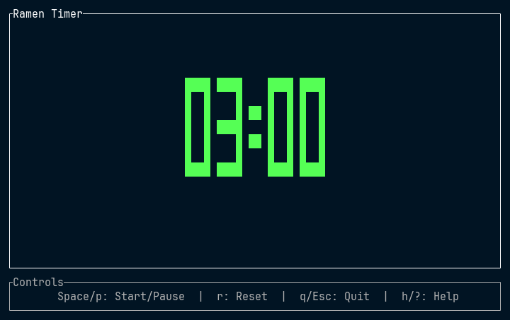

# 🍜 Ramen Timer

Hungry?  

Why not enjoy a delicious bowl of ramen!  
A simple and elegant terminal-based countdown timer for your perfect ramen noodles.  

Never overcook your ramen again!  

(Actually, this is a joke tool I made while learning Rust and TUI development.)

## Features

- **3-minute countdown timer** - Perfect timing for most instant ramen
- **Large, easy-to-read display** - ASCII art numbers for clear visibility
- **Simple controls** - Start, pause, reset with single keystrokes
- **Completion notification** - Bell sound alerts you when your ramen is ready

## Installation

### From crates.io

```bash
cargo install ramen-timer
```

### From Source

```bash
git clone https://github.com/yasuhikomachino/ramen-timer.git
cd ramen-timer
cargo build --release
```

The binary will be available at `target/release/ramen-timer`.

### Using Cargo from Git

```bash
cargo install --git https://github.com/yasuhikomachino/ramen-timer.git
```

## Usage

Simply run the timer:

```bash
ramen-timer
```

You can also specify a custom timer duration:

```bash
# Set timer to 5 minutes
ramen-timer 5:00

# Set timer to 90 seconds
ramen-timer 90
```

### Command Line Arguments

- `TIME` - Timer duration (optional)
  - Format: `M:SS` for minutes and seconds (e.g., `3:00`)
  - Format: `SS` for seconds only (e.g., `180`)
  - Default: 3:00 (3 minutes) if not specified

### Controls

| Key | Action |
|-----|--------|
| `Space` or `p` | Start/Pause timer |
| `r` | Reset to initial time |
| `q` or `Esc` | Quit |
| `h` or `?` | Show help |

## Screenshots

 

## Requirements

- Terminal with minimum size of 25x10 characters
- Terminal bell/beep enabled for completion notification
- System sound volume not muted (check OS system preferences/settings)
- Rust 1.70+ (for building from source)

## Supported Platforms

- macOS 15.5+

Probably works on the following platforms too:
- Windows 11+
- Linux (major distributions)

## License

This project is licensed under the MIT License - see the LICENSE file for details.

## Contributing

Contributions are welcome! Please feel free to submit a Pull Request.
